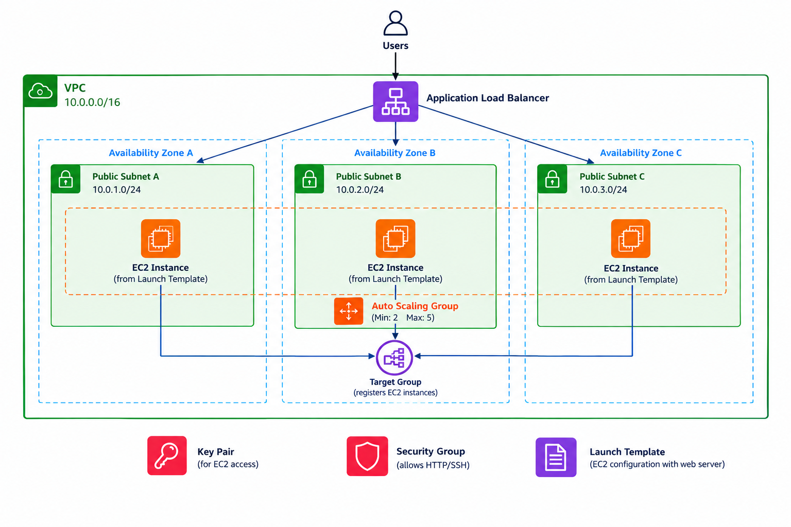

# AWS Highly Available Web App

A highly available web application built on AWS using a custom VPC, 3 public subnets across 3 Availability Zones, EC2, Auto Scaling, and an Application Load Balancer.

## What We Built

* Custom VPC
* 3 public subnets across 3 Availability Zones
* Key Pair
* Security Group
* EC2 Launch Template with a web server
* Auto Scaling Group

  * Minimum: 2 instances
  * Maximum: 5 instances
* Target Group
* Application Load Balancer
* Connected the Load Balancer to the Auto Scaling Group

## Auto Scaling Test

We terminated one EC2 instance.

The Auto Scaling Group detected the instance was gone and automatically launched a replacement to maintain the minimum of 2 instances.

## Architecture

## Deploy

* terraform init
* terraform plan
* terraform apply

